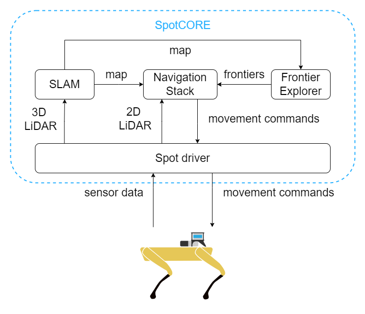
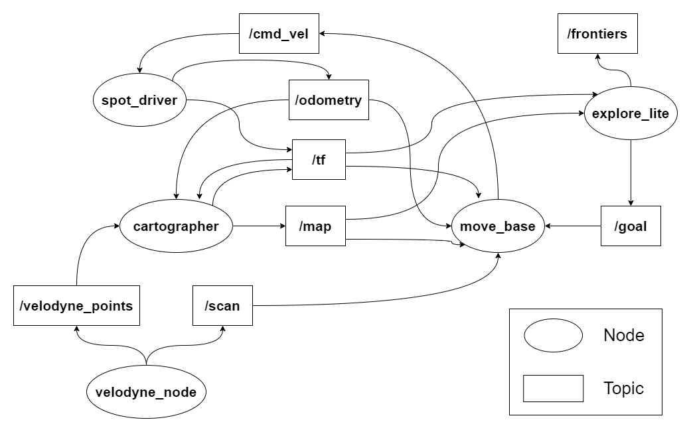

# Spot Autonomous Exploration

- [Spot Autonomous Exploration](#spot-autonomous-exploration)
  - [Installation](#installation)
    - [ROS](#ros)
    - [Spot Exploration](#spot-exploration)
  - [Connecting to SpotCORE](#connecting-to-spotcore)
  - [System Overview](#system-overview)
  - [Running the System](#running-the-system)
  - [Limitations](#limitations)
- [General Spot Information](#general-spot-information)
  - [Credentials](#credentials)
  - [Troubleshooting](#troubleshooting)
    - [LiDAR not detected (Autowalk)](#lidar-not-detected-autowalk)

## Installation

### ROS

In our system SpotCORE acts as the ROS PC. It uses Ubuntu 18.04 LTS, thus ROS Melodic is used. Follow the installation instructions on the [ROS website](http://wiki.ros.org/melodic/Installation/Ubuntu) and install ROS on the SpotCORE.

### Spot Exploration

Clone this package into you catkin workspace or as your catkin workspace. Then run the following commands to install the dependencies:

    cd ~/<catkin_ws_name>
    rosdep install --from-paths src --ignore-src --rosdistro=${ROS_DISTRO} -r -y
After that you can build the package with:

    catkin_make_isolated --install --use-ninja -DPYTHON_EXECUTABLE:FILEPATH=/usr/bin/python3 -DPYTHON_INCLUDE_DIR=/usr/include/python3.6m -DPYTHON_LIBRARY=/usr/lib/python3.6/config-3.6m-x86_64-linux-gnu/libpython3.6.so

This config is needed to build the package with Python3 which is needed for the Spot Driver. See [here](https://github.com/heuristicus/spot_ros#building-for-melodic) for a detailed explanation.

After building you have to source your workspace:

    source ~/catkin_ws/install_isolated/setup.bash

## System Overview
The following image shows the system overview of our Spot Autonomous Exploration System.

The system consists of the following components:

- SLAM node: The SLAM node is used to create a map of the environment. In our case we use [Cartographer](https://google-cartographer-ros.readthedocs.io/en/latest/) SLAM. It uses the 3D LiDAR data to create a map of the environment. The map is then used by the navigation stack and the exploration node.
- Navigation Stack: The navigation stack is used to navigate the robot through the environment. It uses the map created by the SLAM node to plan a trajectory to a goal. In our case we use [move_base](https://wiki.ros.org/move_base) node from the [navigation stack](https://wiki.ros.org/navigation) to plan the trajectory. The movement commands in form of cmd_vel messages are then sent to the robot via the [spot_driver](https://github.com/heuristicus/spot_ros).
- Frontier Exploration node: The frontier exploration node is used to find frontiers (areas currently not explored yet) and send the positions of those to the navigation stack. It uses the map created by the SLAM node to find the frontiers. In our case we use [explore_lite](http://wiki.ros.org/explore_lite).

Here is a more detailed overview of the ROS system, showing the topics and nodes used in our system. Some information is ommitted for clarity.

## Running the System

### Connecting to SpotCORE

To connect to SpotCORE, you need to have installed `vncviewer`. To install it, run the following command:

    sudo apt install tigervnc-viewer

Then after connecting with Spot via Wi-Fi (passwd: `***REMOVED***`), run the following command to connect to SpotCORE via ssh (pwd is `***REMOVED***`):

    ssh -4 -p 20022 spot@192.168.80.3 -L 21000:127.0.0.1:21000

Afterwards, CTRL + SHIFT + T for a new terminal window and run the following command to connect to SpotCORE via VNC:

    vncviewer localhost:21000

The password is `***REMOVED***`. This password is the general admin password for SpotCORE and is asked everytime admin priviliges are needed. Further information can be found in the [Spot SDK](https://dev.bostondynamics.com/docs/payload/spot_core_vnc).

### Exploration
To run the system a few nodes need to be started. Start a new terminal shell by clicking on Activities on the top left corner and type in terminal. Open the programe called Terminal. 

If you first start the terminal you will see that you are located in ~. To change this use the command 

    cd cartographer_ws

Then, open a new terminal to source the correct workspace by clicking CTRL + SHIFT + T. You should see that the correct workspace was sourced.

In general the following nodes need to be started in this order in separate windows:

    roslaunch spot_driver driver.launch
    roslaunch cartographer_ros spot.launch
    roslaunch spot_viz view_robot.launch
    roslaunch move_base move_base.launch

This can be done automatically by typing in:

    tmuxinator

You should see 5 different terminal windows that open with the respective nodes. The fifth window is to claim Spot and power it on.

Before starting the exploration, SpotCORE needs to claim the robot. Make sure the robot is sitting on the floor and powered off and release the control via the tablet. After that run the following command:

    rosservice call spot/claim

Now the robot can be powered on, but before that the E-Stop privilige has to be aquired on the tablet (easier to use). Click the Acquire E-Stop button and then power on the robot with the command:

    rosservice call spot/power_on

After waiting a few seconds the robot should be ready to move. To start the exploration, run the following command:

    roslaunch explore_lite explore.launch

The robot should now stand up rotate 180 degrees to get a starting sweep of the environment and then start exploring. To stop the exploration, press `Ctrl+C` in the terminal where move_base was started. This prevents the robot from receiving trajectory commands. Or you can use the tablet to stop the robot, by pressing the Hijack control button or in the case of an emergency the E-Stop button.

## Limitations

With our current System setup there are a few limitations. The most important ones are:

- The robot can't see transparent objects. This means that Spot would collide with a glass panel, as it would not detect it and the internal object avoidance of Spot would not work. This will be fixed by using Ultrasonic sensors in the future.
- Currently the exploration only works on one floor. If the robot comes near a descending stair it would fall down the stairs as Spot only can descend stairs walking backwards. This will be fixed in the future when implementing a multi-floor exploration system.

# General Spot Information

## Credentials

The following credentials are used on Spot:

    SpotCORE:
    - VNC/root: ***REMOVED***
    
    Spot:
    - Wi-Fi: ***REMOVED***
    - Tablet/Web:
        - username: admin (password: ***REMOVED***)
        - username: user  (password: ***REMOVED***)

## Troubleshooting

### LiDAR not detected (Autowalk)

If the error message LiDAR not detected pops up when trying to start Autowalk, there is a good reason for why. Since the Velodyne LiDAR is connected to Spot to a specific port the `velodyne_driver` for ROS can't simultaneously connect to it. So we decided to change the Port of the LiDAR to a different one so Spot can't connect to it anymore and instead goes directly to the ROS PC. To change this back to the original port you have to visit this site `192.168.1.201` in the browser when connected to the Spot Wi-Fi. Now you have to change to UDP port to `2368` and click on the Save Configuration button. After that you should be able to use Autowalk again.

